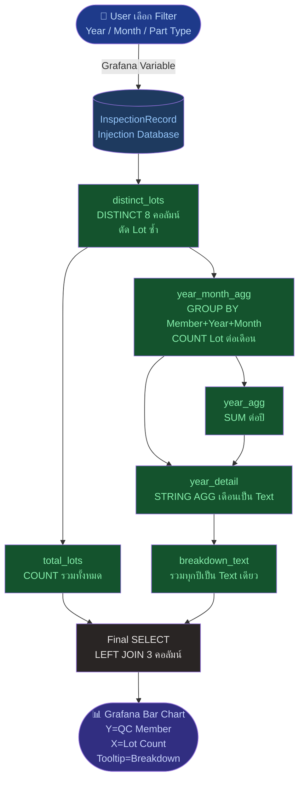
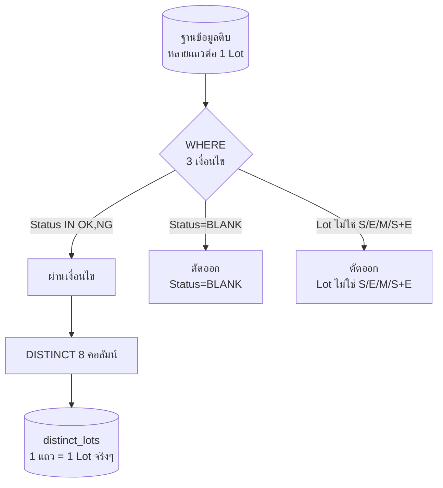
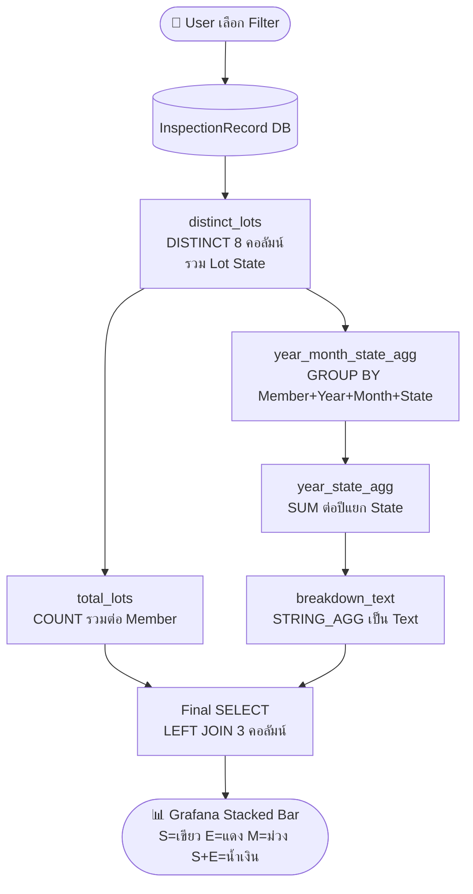
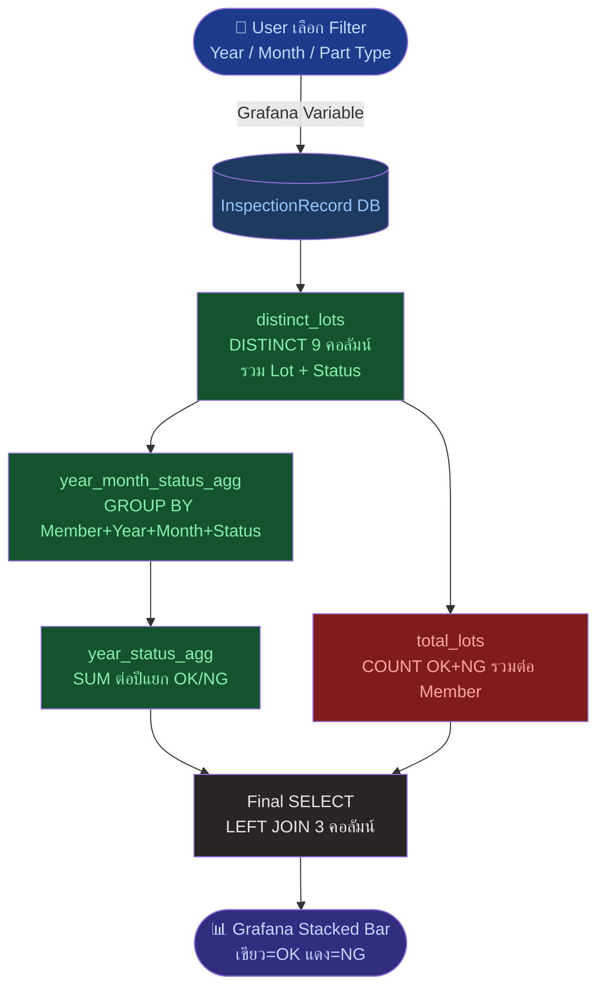
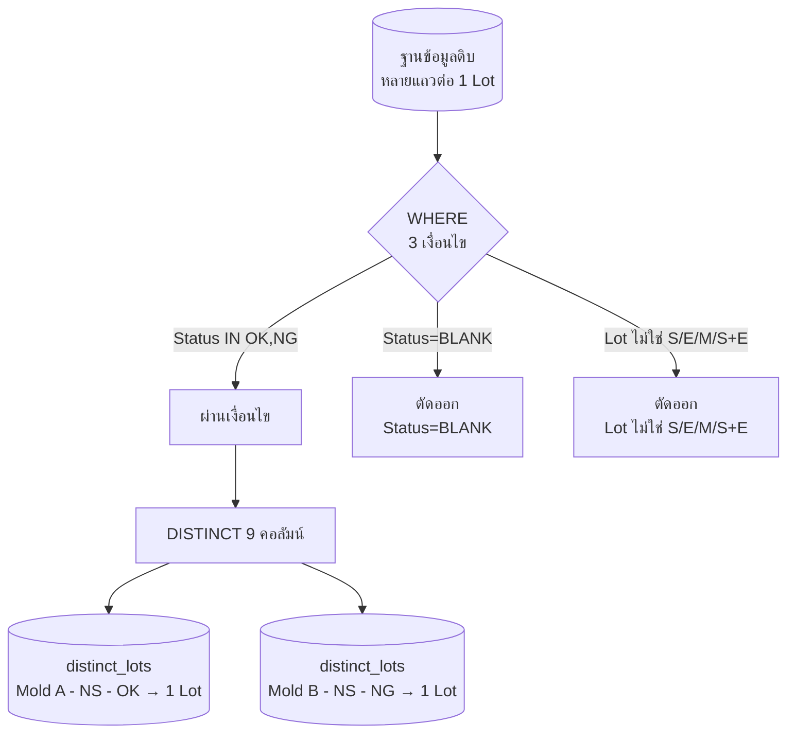

# Dashboard: QC_MEMBER WORKLOAD
# D1 — QC Overview | Panasonic Manufacturing Thailand

Dashboard นี้วัดภาระงาน (Workload) ของ QC Member แต่ละคน
แบ่งเป็น 3 Panel: **BY LOT** | **BY STATE TIMELINE** | **BY STATUS**


---

## Panel 1: QC_MEMBER WORKLOAD BY LOT

งานนี้ คือ QC_MEMBER WORKLOAD BY LOT คือ Dashboard Panel ประเภท Horizontal Bar Chart ที่ถูกออกแบบมาเพื่อวัดภาระงานที่แท้จริงของ QC Member ที่นับเป็นจำนวน Lot นับเป็น lot
### วัตถุประสงค์
วัดปริมาณงานรวม (Workload) ของ QC Member แต่ละคน นับเป็นจำนวน Lot ทั้งหมดที่ตรวจสอบ เพื่อให้ Supervisor เห็นภาพรวมว่าใครรับงานมาก-น้อยเพียงใด
### Business Rules (QC MEMBER WORKLOAD BY LOT)

**Rule 1: Lot Uniqueness — หนึ่ง Lot นับครั้งเดียว**
Lot หนึ่ง Lot ถูกนับเป็นงาน 1 ชิ้นเพียงครั้งเดียว แม้ในฐานข้อมูลจะมีหลายแถวต่อ 1 Lot (จากการบันทึกละเอียดระดับ Cavity/ISC Code) เหตุผล: ป้องกันไม่ให้ Workload ถูกนับสูงเกินจริง (Overcounting) ซึ่งจะทำให้ Supervisor ตัดสินใจผิดพลาด

**Rule 2: Valid Status Only — นับเฉพาะ Lot ที่มีผลตรวจแล้ว**
นับเฉพาะ Lot ที่สถานะเป็น OK หรือ NG เท่านั้น ตัด Lot ที่สถานะว่าง (Blank) ออก เหตุผล: Lot ที่ยังไม่มีผลตรวจถือว่างานยังไม่เสร็จ ไม่ควรนับเป็น Workload ที่ทำสำเร็จแล้ว

**Rule 3: Valid Lot Type Only — นับเฉพาะ Lot ที่ระบุประเภทชัดเจน**
นับเฉพาะ Lot ที่ระบุประเภทเป็น S, E, M หรือ S+E เท่านั้น ตัด Lot ที่ไม่ระบุประเภทออก เหตุผล: Lot ที่ไม่ระบุประเภทคือข้อมูลไม่สมบูรณ์ ไม่ควรนำมานับเป็นภาระงานปกติ

**Rule 4: Time Rollup — รวมยอดจากเดือน → ปี → รวมทั้งหมด**
จำนวน Lot ที่นับได้จะถูกรวมยอดเป็น 3 ระดับ: (1) รายเดือน (2) รายปี (3) รวมทุกปีของคนนั้น เหตุผล: Supervisor ต้องดูได้ทั้งภาพรวมทั้งหมดและรายละเอียดย้อนหลัง เพื่อวิเคราะห์ทั้งภาระงานปัจจุบันและแนวโน้มที่ผ่านมา
ตัวอย่าง  (QC Member: NS):

| ระดับ | ผลลัพธ์ |
| --- | --- |
| รายเดือน | 2025 มิ.ย.: 3 Lot, ก.ค.: 20 Lot, ส.ค.: 274 Lot ... |
| รายปี | 2025 รวม 1,622 Lot / 2026 รวม 1,909 Lot |
| รวมทั้งหมด | NS = 1,622 + 1,909 = 3,531 Lot |


**Rule 5: Ranking — เรียงลำดับจากมากไปน้อย**
แสดง QC Member โดยเรียงจากคนที่มี Lot Count รวมสูงสุดไว้บนสุด ไล่ลงไปจนถึงต่ำสุด
### วิธีการใช้งาน (QC MEMBER WORKLOAD BY LOT)

**Panel 1: QC_MEMBER WORKLOAD BY LOT**
D1 — QC Overview   QC_MEMBER WORKLOAD
QC_MEMBER WORKLOAD BY LOT
ใช้เมื่อ: ต้องการดูภาพรวมว่าแต่ละคนรับงานไปกี่ Lot

**มีขั้นตอนดังนี้**
- เปิด Dashboard D1 — QC Overview → เลือก QC_MEMBER WORKLOAD
- เลือก Data Type  โดยคลิก Dropdown Data Type → เลือก Injection และหากฐานข้อมูลมีหลาย Part Type ต้องระบุให้ตรงกับงาน Injection Molding
- เลือก Year คลิก Dropdown Year → เลือกปีที่ต้องการ เช่น 2026
- เลือก Month คลิก Dropdown Month  เลือกเดือนที่ต้องการ ถ้าต้องการภาพรวมของทุกปี ให้เลือกทุกเดือน และถ้าเลือกเฉพาะเดือนนั้น เช่น Jan, Feb, Mar
### วิธีอ่านผลลัพธ์ (QC MEMBER WORKLOAD BY LOT)
- แกน Y = ชื่อ QC Member แต่ละคน / แกน X = จำนวน Lot ที่ตรวจสอบ
- ความยาวแถบ = ปริมาณ Lot ที่ QC Member คนนั้นตรวจสอบ
- ตัวเลขปลายแถบ = จำนวน Lot รวมทั้งหมดของคนนั้น
- เมื่อชี้ที่แถบ จะเห็นรายละเอียดย้อนหลังแยกตามปีและเดือน เรียงตามลำดับเวลาจริงเสมอ
- ดูความหมายของสี (ไล่ตามปริมาณ Workload):

| สี | ระดับ Workload |
| --- | --- |
| 🟢  เขียว | สูงมาก |
| 🟡   เหลือง | ปานกลาง-สูง |
| 🟠   ส้ม | ปานกลาง |
| 🔴   แดง | ต่ำ |

### หน้าที่ของ Panel (QC MEMBER WORKLOAD BY LOT)
คือ Panel นี้ทำหน้าที่เป็น ตัวชี้วัด Workload ของทีม QC ในภาพรวม โดยแสดงผลเป็น Bar Chart แนวนอนที่เรียงลำดับจาก QC Member ที่ตรวจสอบ Lot มากที่สุดไปหาน้อยที่สุด
### กลไกการทำงาน (QC MEMBER WORKLOAD BY LOT)
Panel นี้ทำงานโดยดึงข้อมูลจากตาราง InspectionRecord แล้วใช้ DISTINCT กรอง 7 คอลัมน์หลักเพื่อตัด Lot ที่ซ้ำกันออก ให้เหลือเฉพาะ Lot ที่ไม่ซ้ำกันจริงๆ ก่อนนำไปนับ จากนั้นกรองเฉพาะ Record ที่มีสถานะ OK หรือ NG และ Lot Type ที่เป็น S, E, M, S+E เท่านั้น เพื่อตัดข้อมูลที่ไม่สมบูรณ์และ Lot ที่ไม่เกี่ยวข้องออก หลังจากได้ Lot ที่สะอาดแล้ว ระบบจะนับจำนวนและจัดกลุ่มตาม QC Member แต่ละคน แล้วเรียงลำดับจากมากไปน้อย เพื่อให้เห็นภาพการกระจาย Workload ของทุกคน
⚠️ หมายเหตุ: ตัวอย่างข้อมูลในส่วนนี้เป็น ข้อมูลจริงจากปี 2026 ที่คัดมาจากฐานข้อมูล เพื่อใช้อธิบายกลไกการทำงานเท่านั้น ห้ามนำตัวอย่างเหล่านี้ไปสับสนกับการวิเคราะห์ข้อมูลจริงในการใช้งาน

**Step 1: User เลือก Filter**
User กด Dropdown เลือก:
Grafana แปลง Filter เป็น Variable
หมายเหตุ: ข้อมูลในตารางด้านล่างเป็น "ข้อมูลจริง" จากไฟล์ InspectionRecord ปี 2026 อย่าสับสนกับข้อมูลสมมุติ
ฐานข้อมูลดิบเก็บข้อมูลเป็นหลายแถวต่อ 1 Lot เนื่องจาก 1 Lot มีหลาย Cavity และหลายจุดวัด เช่น Mold No. 1992 ของ QC Member TJ ในเดือน 1 ปี 2026 มีแถวข้อมูลถึง 28 แถว แต่นับเป็น 1 Lot เท่านั้น

**ยกตัวอย่าง (Example) ข้อมูลดิบก่อนกรอง ปี 2026:**

| Mold No. | QC Member | Year Record | Month | File Run | Sequence | Status | Lot |
| --- | --- | --- | --- | --- | --- | --- | --- |
| 1992 | TJ | 2026 | 1 | 1 | 1 | OK | S |
| 1992 | TJ | 2026 | 1 | 1 | 1 | OK | S |
| 1992 | TJ | 2026 | 1 | 1 | 1 | OK | S |
| ... | ... | ... | ... | ... | ... | ... | ... |
| 879 | NS | 2026 | 1 | 1 | 1 | OK | S+E |
| 879 | NS | 2026 | 1 | 1 | 1 | OK | S+E |
| 2140 | NO | 2026 | 1 | 1 | 1 | OK | S |
| 1051 | WS | 2026 | 1 | 1 | 1 | Blank | - |

กรอง WHERE:
✅ Status IN ('OK', 'NG') → ตัด BLANK ออก
✅ Lot IN ('S','E','M','S+E') → ตัด Lot Blank ออก
✅ Year, Month, Part Type ตาม Filter ที่เลือก
[Part Type], [Mold No.], [QC Member],
[Year Record], [Month Record], [File Run No.], [Sequence]

**Step 3: year_month_agg — นับ Lot ต่อปีและเดือน**
นำ distinct_lots มา GROUP BY QC Member + Year + Month แล้วนับ COUNT(*) ต่อกลุ่ม
ยกตัวอย่าง (Example) ผลลัพธ์ของ NS ปี 2026 เดือน 1:

| QC Member | year | mo_name | mo_num | lot_cnt |
| --- | --- | --- | --- | --- |
| NS | 2026 | Jan | 1 | 398 |

เช่น NS ตรวจสอบ Lot ในเดือนมกราคม 2026 ทั้งหมด 398 Lot

**Step 4: year_agg — รวมยอดต่อปี**
นำ year_month_agg มา SUM(lot_cnt) GROUP BY QC Member + Year
ยกตัวอย่าง (Example) ของ NS:

| QC Member | yr | year_total |
| --- | --- | --- |
| NS | 2025 | 1,909 |
| WT | 2025 | 1,528 |
| WS | 2026 | (ตัวเลขจริงจากฐานข้อมูล) |

เช่น NS ทำ Lot รวมในปี 2026 ทั้งหมด 1,909 Lot

**Step 5: year_detail — รวมเดือนเป็น Text ต่อปี**
STRING_AGG รวมทุกเดือนในปีเดียว เรียงตาม mo_num
ยกตัวอย่าง (Example) ผลลัพธ์ Text ของ NS ปี 2026:
"Jan:398 / Feb:286 / Apr:380 / May:378 / Jun:408 / Jul:59"
เช่น ในเดือนมกราคม NS ทำ 398 Lot เดือนกุมภาพันธ์ทำ 286 Lot เป็นต้น

**Step 6: breakdown_text — รวมทุกปีเป็น Text เดียว**
STRING_AGG รวมทุกปี คั่นด้วย CHAR(10) (ขึ้นบรรทัดใหม่ระหว่างแต่ละปี)
ยกตัวอย่าง (Example) Text สุดท้ายของ NS ที่แสดงใน Tooltip:
2025: 1622 (Jun:3 / Jul:20 / Aug:274 / Sep:403 / Oct:387 / Nov:329 / Dec:206)
2026: 1909 (Jan:398 / Feb:286 / Apr:380 / May:378 / Jun:408 / Jul:59)
เช่น เมื่อ User hover ที่แถบ NS จะเห็น Text นี้ใน Tooltip ของ Grafana

**Step 7: total_lots — นับยอดรวมทั้งหมด**
COUNT(*) จาก distinct_lots GROUP BY QC Member
ยกตัวอย่าง (Example) ยอดรวมจริงปี 2025–2026:

| QC Member | Lot Count |
| --- | --- |
| NS | 3,531 |
| WT | 3,328 |
| WS | 2,612 |
| NO | 1,316 |
| WK | 623 |
| TJ | 76 |
| KN | 30 |

เช่น ตัวเลข 3,531 ของ NS คือความยาวของแถบสีในกราฟโดยตรง
ยกตัวอย่าง (Example) ผลลัพธ์สุดท้าย:

| QC Member | Lot Count | Lot Count per Year/Month |
| --- | --- | --- |
| NS | 3,531 | 2025: 1622 (Jun:3 / Jul:20 / ...) 2026: 1909 (Jan:398 / Feb:286 / ...) |
| WT | 3,328 | … |
| WS | 2,612 | … |

เช่น Grafana นำคอลัมน์ QC Member ไปแสดงบนแกน Y นำ Lot Count ไปกำหนดความยาวแถบบนแกน X และนำ Lot Count per Year/Month ไปแสดงใน Tooltip เมื่อ User hover
⚠️ หมายเหตุสำคัญ: ตัวเลขและ Mold No. ที่แสดงในทุก Step ข้างต้นเป็นข้อมูลจริงจากไฟล์ InspectionRecord ปี 2026 และยอดสะสมปี 2025–2026 ยกเว้นแถวที่มีข้อความว่า "(ตัวเลขจริงจากฐานข้อมูล)" ซึ่งขึ้นอยู่กับช่วงเวลาที่ User เลือก Filter
Identical ID: ไม่ได้ถูกนำมาแสดงใน Step ใดเลย เพราะ User ไม่ได้สนใจค่านี้ มันทำหน้าที่เป็น Key ภายในฐานข้อมูลเท่านั้น และถูกแทนที่ด้วย Mold No. ในการแสดงผลทุกที่ครับ
### Mermaid Diagrams







---

## Panel 2: QC_MEMBER WORKLOAD BY STATE TIMELINE

งานนี้ คือ QC_MEMBER WORKLOAD BY STATE TIMELINE คือ Panel ที่ตรวจสอบค่า State Timeline ของจำนวน Lot ที่ได้ถูกวัดงานที่ของแต่ละ QC Member ที่นับเป็นจำนวน Lot นับเป็น lot
### วัตถุประสงค์
เปิดเผยว่า QC Member แต่ละคนรับผิดชอบ Lot ในช่วงจังหวะใดของสายการผลิตเป็นหลัก (เริ่มต้น / กลาง / สิ้นสุด / ครอบคลุมทั้งต้นและท้าย)
### Business Rules (QC MEMBER WORKLOAD BY STATE TIMELINE)
ใช้ Rule 1-3 เดียวกันกับ Panel BY LOT (Lot Uniqueness, Valid Status, Valid Lot Type) เป็นพื้นฐาน แต่เพิ่มกฎเฉพาะดังนี้:

**Rule 1: Lot Uniqueness — หนึ่ง Lot นับครั้งเดียว**
Lot หนึ่ง Lot ถูกนับเป็นงาน 1 ชิ้นเพียงครั้งเดียว แม้ในฐานข้อมูลจะมีหลายแถวต่อ 1 Lot (จากการบันทึกละเอียดระดับ Cavity/ISC Code) เหตุผล: ป้องกันไม่ให้ Workload ถูกนับสูงเกินจริง (Overcounting) ซึ่งจะทำให้ Supervisor ตัดสินใจผิดพลาด

**Rule 2: Valid Status Only — นับเฉพาะ Lot ที่มีผลตรวจแล้ว**
นับเฉพาะ Lot ที่สถานะเป็น OK หรือ NG เท่านั้น ตัด Lot ที่สถานะว่าง (Blank) ออก เหตุผล: Lot ที่ยังไม่มีผลตรวจถือว่างานยังไม่เสร็จ ไม่ควรนับเป็น Workload ที่ทำสำเร็จแล้ว

**Rule 3: Valid Lot Type Only — นับเฉพาะ Lot ที่ระบุประเภทชัดเจน**
นับเฉพาะ Lot ที่ระบุประเภทเป็น S, E, M หรือ S+E เท่านั้น ตัด Lot ที่ไม่ระบุประเภทออก เหตุผล: Lot ที่ไม่ระบุประเภทคือข้อมูลไม่สมบูรณ์ ไม่ควรนำมานับเป็นภาระงานปกติ

**Rule 4: Grouping — จัดกลุ่มตาม QC Member + State**
นับจำนวน Lot แยกเป็น 4 กลุ่มย่อยต่อคน (S, E, M, S+E) แล้วนำมาต่อกันเป็นแท่งเดียวแบบซ้อนสี (Stacked Bar) เหตุผล: ให้เห็น 2 มิติพร้อมกันในกราฟเดียว คือปริมาณงานรวม และสัดส่วนความเสี่ยงของงานที่รับผิดชอบ
### วิธีการใช้งาน (QC MEMBER WORKLOAD BY STATE TIMELINE)

**Panel 2: QC_MEMBER WORKLOAD BY STATE TIMELINE**
D1 — QC Overview   QC_MEMBER WORKLOAD
QC_MEMBER WORKLOAD BY STATE TIMELINE
ใช้เมื่อ: ต้องการรู้ว่าแต่ละคนรับ Lot ช่วงไหนของสายการผลิตเป็นหลัก

**มีขั้นตอนดังนี้**
เปิด Dashboard D1 — QC Overview → เลือก QC_MEMBER WORKLOAD → แท็บ BY STATE TIMELINE
เลือก Filter ให้ตรงกับช่วงเวลาที่ต้องการ
Data Type = Injection
Year = ปีที่ต้องการ
Months = เดือนที่ต้องการ หรือเลือกทั้งหมด
### วิธีอ่านผลลัพธ์ (QC MEMBER WORKLOAD BY STATE TIMELINE)
- ขั้นตอนที่ 1: อ่านโครงสร้างกราฟก่อน
- แกน Y (ซ้าย)  = ชื่อ QC Member พร้อมยอดรวม เช่น NS [3545]
- แกน X (ล่าง)  = จำนวน Lot รวมทั้งหมด
- สีในแถบ       = ประเภทของ Lot State (ซ้อนกันใน 1 แถบ)
- ตัวเลขวงเล็บ  = ยอด Lot รวมทุก State ของคนนั้น
- ดูที่ Legend ด้านล่างก่อนอ่านกราฟ เพื่อทำความเข้าใจสีแต่ละสี
🟢 S (Start) = Lot ช่วงเริ่มต้นการผลิต
🔴 E (End) = Lot ช่วงสิ้นสุดการผลิต 
🟣 M (Middle) = Lot ช่วงกลางการผลิต 
🔵 S+E (Start+End) = Lot ที่ครอบคลุมทั้งต้นและท้าย
- อ่านตัวเลขในวงเล็บ ยกตัวอย่าง เช่น
NS [3545] → NS มี Lot รวมทั้งหมด 3,545 Lot
WT [3353]→ WT มี Lot รวมทั้งหมด 3,353 Lot
WS [2643] → WS มี Lot รวมทั้งหมด 2,643 Lot
NO [1332] → NO มี Lot รวมทั้งหมด 1,332 Lot
WK  [623] → WK มี Lot รวมทั้งหมด   623 Lot
TJ     [76] → TJ มี Lot รวมทั้งหมด    76 Lot
KN   [34] → KN มี Lot รวมทั้งหมด    34 Lot

**ขั้นตอนที่ 3: อ่านสีในแต่ละแถบ**

**จากภาพที่เห็น แถบของแต่ละคน ยกตัวอย่าง เช่น (เป็นข้อมูลสมมุติ)**

**NS [3545]**

**── 🟢 S (Start) ────────────────**

**── 🔵 S+E ──────────────────────────────────────**

**WT [3353]**

**── 🟢 S ────────────────**

**── 🔵 S+E ─────────────────────────────────────**

**WS [2643]**

**── 🟢 S ───────────────**

**── 🔵 S+E ────────────────────────────**

**NO [1332]**

**── 🟢 S ──────────**

**── 🔵 S+E ────────────────**

**WK [623]**

**── 🟢 S ──**

**── 🔵 S+E ────────────**

**TJ [76]**

**── 🔵 S+E ─**

**KN [34]**

**── 🔵 S+E ─**
### หน้าที่ของ Panel (QC MEMBER WORKLOAD BY STATE TIMELINE)
Panel นี้ทำหน้าที่เป็น แผนที่กระจาย Workload เชิง Timeline โดยแสดงผลเป็น Bar Chart แนวนอนแบบ Stacked ที่แต่ละแถบแทน QC Member หนึ่งคน และภายในแถบนั้นจะแบ่งสีตาม Lot State ทั้ง 4 ประเภท ทำให้อ่านได้สองมิติในเวลาเดียวกัน คือมิติแรกเป็นปริมาณงานรวมของแต่ละคน และมิติที่สองเป็นสัดส่วนของงานแต่ละ State ที่คนนั้นรับผิดชอบ
### กลไกการทำงาน (QC MEMBER WORKLOAD BY STATE สรุป)
QR_MEMBER WORKLOAD BY STATE TIMELINE เป็น Panel ที่ต่อยอดจาก BY LOT โดยไม่ได้นับแค่ว่าแต่ละคนรับ Lot ไปกี่ Lot แต่แบ่งแยกให้เห็นว่า Lot เหล่านั้นอยู่ในสถานะใดของสายการผลิต ได้แก่ S (Start), E (End), M (Middle) และ S+E (Start+End) ความแตกต่างหลักจาก BY LOT คือการเพิ่มคอลัมน์ [Lot] เข้าไปใน DISTINCT เพื่อแยกนับ Lot ตาม State โดยผลลัพธ์ที่ได้แสดงเป็น Stacked Bar Chart ที่แต่ละสีแทน 1 State

**Step 1: User เลือก Filter**
User กด Dropdown เลือก:
Grafana แปลง Filter เป็น Variable
⚠️ หมายเหตุ: ข้อมูลในตารางด้านล่างเป็นข้อมูลจริงจากไฟล์ InspectionRecord ปี 2026 อย่าสับสนกับข้อมูลสมมุติ
ยกตัวอย่าง (Example) ข้อมูลดิบก่อนกรอง ปี 2026 เดือน 1:

| Mold No. | QC Member | Year | Month | File Run No. | Sequence | Status | Lot |
| --- | --- | --- | --- | --- | --- | --- | --- |
| 1992 | TJ | 2026 | 1 | 1 | 1 | OK | S |
| 1992 | TJ | 2026 | 1 | 1 | 1 | OK | S |
| 1992 | TJ | 2026 | 1 | 1 | 1 | OK | S |
| 2140 | NO | 2026 | 1 | 1 | 1 | OK | S |
| 2140 | NO | 2026 | 1 | 1 | 1 | OK | E |
| M-422-C | WT | 2026 | 1 | 1 | 1 | OK | S+E |
| M-422-C | WT | 2026 | 1 | 1 | 1 | OK | S+E |
| 1051 | WS | 2026 | 1 | 1 | 1 | BLANK | - |

เช่น Mold No. 1992 ของ TJ มีข้อมูลดิบ 7 แถวในฐานข้อมูล แต่เมื่อผ่าน DISTINCT แล้วจะเหลือแค่ 1 แถว เพราะทั้ง 7 แถวมีค่าทุกคอลัมน์เหมือนกัน
กรอง WHERE 3 เงื่อนไข:
✅ Status IN ('OK', 'NG') → ตัด BLANK ออก
✅ Lot IN ('S', 'E', 'M', 'S+E') → ตัด Lot Blank ออก
✅ Year, Month, Part Type ตาม Filter ที่ User เลือก
[Part Type], [Mold No.], [QC Member],
[Year Record], [Month Record], [File Run No.], [Sequence], [Lot]
ผลลัพธ์ distinct_lots ยกตัวอย่าง (Example) ปี 2026 เดือน 1:
[Part Type], [Mold No.], [QC Member], [Year Record], [Month Record], [File Run No.], [Sequence], [Lot]
ผลลัพธ์ distinct_lots ยกตัวอย่าง (Example) ปี 2026 เดือน 1:

| Mold No. | QC Member | Year | Month | File Run No. | Sequence | Status | Lot |
| --- | --- | --- | --- | --- | --- | --- | --- |
| 1992 | TJ | 2026 | 1 | 1 | 1 | OK | S |
| 2140 | NO | 2026 | 1 | 1 | 1 | OK | S |
| 2140 | NO | 2026 | 1 | 1 | 1 | OK | E |
| M-422-C | WT | 2026 | 1 | 1 | 1 | OK | S+E |
| 879 | NS | 2026 | 1 | 1 | 1 | OK | S+E |

เช่น Mold No. 2140 ของ NO ปรากฏ 2 แถวเพราะมีทั้ง Lot S และ Lot E ซึ่งนับแยกกัน

**STEP 3: year_month_state_agg — นับ Lot ต่อปี เดือน และ State**
นำ distinct_lots มา GROUP BY QC Member + Year + Month + Lot State แล้วนับ COUNT(*) ต่อกลุ่ม
ยกตัวอย่าง (Example) ผลลัพธ์จริงของ NS ปี 2026:

| QC Member | Year | Month | Lot State | Lot_Count |
| --- | --- | --- | --- | --- |
| NS | 2026 | Jan | S | (ข้อมูลตามจริง) |
| NS | 2026 | Jan | E | (ข้อมูลตามจริง) |
| NS | 2026 | Jan | M | (ข้อมูลตามจริง) |
| NS | 2026 | Jan | S+E | (ข้อมูลตามจริง) |

เช่น NS ในเดือนมกราคม 2026 มี Lot แยกเป็น 4 กลุ่มตาม State แต่ละกลุ่มนับแยกกัน

**STEP 4: year_state_agg — รวมยอดต่อปีแยกตาม State**
นำ year_month_state_agg มา SUM(lot_cnt) GROUP BY QC Member + Year + Lot State
ยกตัวอย่าง (Example) ยอดรวมจริงของทุก QC Member ปี 2026:

| QC Member | Year | Lot State | Year Total |
| --- | --- | --- | --- |
| NT | 2026 | S | 205 |
| NT | 2026 | E | 203 |
| NT | 2026 | M | 70 |
| NT | 2026 | S+E | 399 |
| WT | 2026 | S | 121 |
| WT | 2026 | E | 118 |
| WT | 2026 | M | 55 |
| WT | 2026 | S+E | 392 |
| WS | 2026 | S | 170 |
| WS | 2026 | E | 167 |
| WS | 2026 | M | 93 |
| WS | 2026 | S+E | 257 |

เช่น NS มี Lot ประเภท S+E สูงที่สุด 399 Lot ในปี 2026 ซึ่งแสดงว่ารับงานที่ครอบคลุมทั้งต้นและท้ายสายการผลิตเยอะที่สุด

**STEP 5: total_per_member — รวมยอด Lot ทั้งหมดต่อ QC Member**
นับ Lot รวมทุก State เพื่อใช้แสดงในวงเล็บชื่อ เช่น NS [3539]
ยกตัวอย่าง (Example) ยอดรวมจริงปี 2026:

| QC Member | S | E | M | S+E | จำนวนLot ของ ปี 2026 |
| --- | --- | --- | --- | --- | --- |
| NS | 205 | 203 | 70 | 399 | 877 |
| WT | 121 | 118 | 55 | 392 | 686 |
| WS | 170 | 167 | 93 | 257 | 687 |
| NO | 84 | 82 | 37 | 89 | 292 |
| WK | 2 | 2 | 2 | 11 | 17 |
| TJ | 10 | 0 | 0 | 3 | 13 |


**เช่น ตัวเลข 877 ของ NS ในปี 2026 คือความยาวรวมของแถบ NS เมื่อดูเฉพาะปี 2026 เท่านั้น**

**STEP 6: สร้าง Tooltip Text แยกตาม State**
STRING_AGG รวมข้อมูล State ต่อปีเป็น Text เพื่อแสดงใน Tooltip
ยกตัวอย่าง (Example) Text ของ NS เมื่อ hover:
2026: 877 Lot
S   : 205 Lot
E   : 203 Lot
M   :  70 Lot
S+E : 399 Lot
เช่น เมื่อ User hover ที่แถบ NS จะเห็นรายละเอียดแยก State ทันที

**STEP 7: total_lots — นับยอดรวมทั้งหมดทุกปี**
COUNT(*) จาก distinct_lots GROUP BY QC Member รวมทุกปีที่เลือก
ยกตัวอย่าง (Example) ยอดรวมจริงทุกปีที่แสดงในวงเล็บบน Dashboard:

| QC Member | Lot Count |
| --- | --- |
| NS | 3,539 |
| WT | 3,344 |
| WS | 2,638 |
| NO | 1,323 |
| WK | 623 |
| TJ | 76 |
| KN | 34 |

เช่น ตัวเลข 3,539 ใน NS [3539] คือยอด Lot รวมทุก State ทุกปีที่ User เลือก
Grafana รับผลลัพธ์แล้วแยกสีตาม Lot State ในแถบเดียวกัน
ยกตัวอย่าง (Example) สิ่งที่เห็นบน Dashboard จริง:

**NS [3539]**

**├── 🟢 S (Start)     ───────────────────**

**├── 🔴 E (End)       (เล็กมาก แทบมองไม่เห็น)**

**├── 🟣 M (Middle)    (เล็กมาก แทบมองไม่เห็น)**

**└── 🔵 S+E (Start+End) ─────────────────────────────────────────**
เช่น NS มีแถบสีน้ำเงิน (S+E) ยาวที่สุด แสดงว่ารับ Lot ที่ครอบคลุมทั้งต้นและท้ายสายการผลิตมากที่สุดในทีม
⚠️ หมายเหตุสำคัญ: ตัวเลขทั้งหมดใน STEP 2–8 ข้างต้น (205, 203, 70, 399, 877, 3,539 ฯลฯ) เป็นข้อมูลจริงจากไฟล์ InspectionRecord ปี 2026 อย่าสับสนกับข้อมูลสมมุติ ตัวเลขอาจเปลี่ยนแปลงได้ตามช่วงเวลาที่ User เลือก Filter บน Dashboard
Identical ID: ไม่ได้ถูกนำมาแสดงใน Step ใดเลย เพราะ User ไม่ได้สนใจค่านี้ มันทำหน้าที่เป็น Key ภายในระบบเท่านั้น และถูกแทนที่ด้วย Mold No. ในการแสดงผลทุกที่ครับ
### Mermaid Diagrams




```mermaid
flowchart LR
A["BY LOT\nDISTINCT 8 คอลัมน์\nไม่แยก State\n→ 1 Mold = 1 แถว"]
B["BY STATE TIMELINE\nDISTINCT 8 คอลัมน์\nรวม [Lot] ด้วย\n→ Mold เดิม S+E ≠ S"]

A -->|เพิ่ม [Lot]| B
```


---

## Panel 3: QC_MEMBER WORKLOAD BY STATUS

งานนี้ คือ QC_MEMBER WORKLOAD BY STATUS คือ Panel ที่ตรวจสอบค่า Status ที่แบ่งเป็น ‘OK’ คือ ผ่านเกณฑ์ และ ‘NG’ คือ ไม่ผ่านเกณฑ์  ของจำนวน Lot ที่ได้ถูกวัดงานที่ของแต่ละ QC Member ที่นับเป็นจำนวน Lot
### วัตถุประสงค์
เป็นตัวชี้วัดคุณภาพสุดท้ายของกลุ่ม Panel นี้ — บอกว่าปริมาณงานที่ QC Member แต่ละคนรับไปนั้น ส่งผลต่อคุณภาพการตรวจสอบหรือไม่ ก่อนที่ของเสียจะหลุดถึงมือลูกค้า
### Business Rules (QC MEMBER WORKLOAD BY STATUS)
ใช้ Rule 1-3 เดียวกันกับ Panel BY LOT เป็นพื้นฐาน (Lot Uniqueness, Valid Status, Valid Lot Type) เพิ่มกฎเฉพาะดังนี้:

**Rule 1: Lot Uniqueness — หนึ่ง Lot นับครั้งเดียว**
Lot หนึ่ง Lot ถูกนับเป็นงาน 1 ชิ้นเพียงครั้งเดียว แม้ในฐานข้อมูลจะมีหลายแถวต่อ 1 Lot (จากการบันทึกละเอียดระดับ Cavity/ISC Code) เหตุผล: ป้องกันไม่ให้ Workload ถูกนับสูงเกินจริง (Overcounting) ซึ่งจะทำให้ Supervisor ตัดสินใจผิดพลาด

**Rule 2: Valid Status Only — นับเฉพาะ Lot ที่มีผลตรวจแล้ว**
นับเฉพาะ Lot ที่สถานะเป็น OK หรือ NG เท่านั้น ตัด Lot ที่สถานะว่าง (Blank) ออก เหตุผล: Lot ที่ยังไม่มีผลตรวจถือว่างานยังไม่เสร็จ ไม่ควรนับเป็น Workload ที่ทำสำเร็จแล้ว

**Rule 3: Valid Lot Type Only — นับเฉพาะ Lot ที่ระบุประเภทชัดเจน**
นับเฉพาะ Lot ที่ระบุประเภทเป็น S, E, M หรือ S+E เท่านั้น ตัด Lot ที่ไม่ระบุประเภทออก เหตุผล: Lot ที่ไม่ระบุประเภทคือข้อมูลไม่สมบูรณ์ ไม่ควรนำมานับเป็นภาระงานปกติ

**Rule 4: Status Classification — แบ่ง Lot ออกเป็น 2 กลุ่มตามผลตรวจ**

| Status | ความหมาย | สีในภาพ |
| --- | --- | --- |
| OK | Lot ที่ผ่านเกณฑ์คุณภาพ | 🟢   เขียว |
| NG | Lot ที่ไม่ผ่านเกณฑ์คุณภาพ | 🔴    แดง |


**Rule 5: Grouping — จัดกลุ่มตาม QC Member + Status**
นับจำนวน Lot แยกเป็น OK และ NG ต่อคน แล้วนำมาต่อกันเป็นแท่งเดียวแบบซ้อนสี เหตุผล: ให้เห็นทั้งปริมาณงานรวมและสัดส่วนคุณภาพในกราฟเดียว ใช้คำนวณ NG Rate ของแต่ละคนได้ทันที
ตัวอย่าง (QC Member: NS):
Lot ทั้งหมดของ NS = 3,545 แบ่งเป็น OK 3,500 Lot (สีเขียว) และ NG 45 Lot (สีแดง)
### วิธีการใช้งาน (QC MEMBER WORKLOAD BY STATUS)

**Panel 3: QC_MEMBER WORKLOAD BY STATUS**
D1 — QC Overview   QC_MEMBER WORKLOAD
QC_MEMBER WORKLOAD BY STATUS

**ขั้นตอน:**
เปิด Dashboard D1 — QC Overview → เลือก QC_MEMBER WORKLOAD → แท็บ BY STATUS
เลือก Filter ให้ตรงกับช่วงเวลาที่ต้องการ
Data Type = Injection
Year = ปีที่ต้องการ
Months = เดือนที่ต้องการ หรือเลือกทั้งหมด
- ถ้าต้องการดูตัวเลขแบบละเอียดเป็นตาราง ให้เปิดสวิตช์ Table view (มุมบนขวา) แทนการดูเป็นกราฟ
สำหรับ Panel นี้เพื่อ ประเมินภาระงาน (Workload) ของแต่ละ QC Member และ เปรียบเทียบสัดส่วน NG เบื้องต้น ว่าใครมีสัดส่วนงาน NG สูงผิดปกติเมื่อเทียบกับปริมาณงานที่ตรวจ


### วิธีอ่านผลลัพธ์ (QC MEMBER WORKLOAD BY STATUS)
- ดูที่ Legend ด้านล่างก่อนอ่านกราฟ เพื่อทำความเข้าใจสีแต่ละสี
- 🟢   = OK คือ Lot ที่มีผ่านเกณฑ์
- 🔴  = NG คือ Lot ที่ไม่ผ่านเกณฑ์
โดยที่ มีการต่อกันเป็นแท่งเดียว (Stacked) — ความยาวรวมของแท่ง = จำนวน Lot ทั้งหมดที่คนนั้นตรวจ
- โครงสร้างกราฟ
- แกน Y (ซ้าย): รายชื่อ QC Member (เช่น NS, WT, WS, NO, WK, TJ, KN) พร้อมตัวเลขในวงเล็บ = จำนวน Lot รวมทั้งหมด ที่คนนั้นตรวจในช่วงเวลาที่กรอง เช่น NS (3589) หมายถึง NS ตรวจไปทั้งหมด 3,589 Lot
- แกน X (ล่าง): จำนวน Lot (หน่วยนับ ไม่ใช่ %)
- แท่งสีเขียว: จำนวน Lot ที่ผลตรวจเป็น OK
- แท่งสีแดง: จำนวน Lot ที่ผลตรวจเป็น NG (ต่อท้ายแท่งเขียว)
สำหรับ Panel นี้เพื่อ ประเมินภาระงาน (Workload) ของแต่ละ QC Member และ เปรียบเทียบสัดส่วน NG เบื้องต้น ว่าใครมีสัดส่วนงาน NG สูงผิดปกติเมื่อเทียบกับปริมาณงานที่ตรวจ
### หน้าที่ของ Panel (QC MEMBER WORKLOAD BY STATUS)
Panel นี้ทำหน้าที่เป็น แผนที่กระจาย Workload เชิง Status ที่แบ่งเป็น “OK” คือ ผ่านเกณฑ์ และ “NG” คือ ไม่ผ่านเกณฑ์  โดยแสดงผลเป็น Bar Chart แนวนอนแบบ Stacked ที่แต่ละแถบแทน QC Member หนึ่งคน และภายในแถบนั้นจะแบ่งสีตาม Status ทั้ง 2 มิติ คือ มิติที่ 1  เป็นปริมาณงานรวมของแต่ละคน และมิติที่ 2 เป็นสัดส่วนของงานแต่ละ Status ที่ถูกตรวจสอบภายใน Lot ของQC Member คนนั้นรับผิดชอบ
### กลไกการทำงาน (QC MEMBER WORKLOAD BY STATUS)
Panel นี้เริ่มต้นด้วยการใช้ LTRIM และ RTRIM ตัดช่องว่างด้านซ้ายและด้านขวาของข้อมูลออกก่อนทุกครั้ง เพื่อป้องกันปัญหาที่ระบบแยก “NS" กับ “NS " ออกเป็นคนละค่าจนตัวเลขผิดเพี้ยน จากนั้นใช้ DISTINCT กรองข้อมูลผ่าน CTE โดยพิจารณาจาก 7 คอลัมน์หลักร่วมกันเพื่อให้ได้เฉพาะ Lot ที่ไม่ซ้ำกันจริงๆ ก่อนนำไปนับ แล้วกรองเหลือเฉพาะ Record ที่มี Status เป็น OK หรือ NG และ Lot Type เป็น S, E, M, S+E เท่านั้น เพื่อตัดข้อมูลที่ไม่สมบูรณ์ออก สุดท้ายนับจำนวน Lot โดยจัดกลุ่มตาม QC Member คู่กับ Status แต่ละประเภท แสดงผลเป็น Stacked Bar Chart แยกสีเขียว OK และสีแดง NG

**Step 1: User เลือก Filter**
User กด Dropdown เลือก:
Grafana แปลง Filter เป็น Variable
⚠️ หมายเหตุ: ข้อมูลในตารางด้านล่างเป็นข้อมูลจริงจากไฟล์ InspectionRecord ปี 2026 อย่าสับสน
กับข้อมูลสมมุติ
ยกตัวอย่าง (Example) ข้อมูลดิบก่อนกรอง ปี 2026:

| Mold No. | QC Member | Year | Month | File Run No. | Sequence | Status | Lot |
| --- | --- | --- | --- | --- | --- | --- | --- |
| 1992 | TJ | 2026 | 1 | 1 | 1 | OK | S |
| 1992 | TJ | 2026 | 1 | 1 | 1 | OK | S |
| 1992 | TJ | 2026 | 1 | 1 | 1 | OK | S |
| … | … | … | … | … | … | … | … |
|  |  |  |  |  |  |  |  |
| 1515 | NS | 2026 | 4 | 1 | 1 | NG | S+E |
| 1515 | NS | 2026 | 4 | 1 | 1 | NG | S+E |
|  |  |  |  |  |  |  |  |
| 1079 | WT | 2026 | 4 | 1 | 1 | NG | S |
| 1079 | WT | 2026 | 4 | 1 | 1 | NG | S |
| XXXX | XX | 2026 | 1 | 1 | 1 | BLANK | - |

เช่น Mold No. 1992 ของ TJ มีข้อมูลดิบ 7 แถวในฐานข้อมูล แต่เมื่อผ่าน DISTINCT แล้วเหลือแค่ 1 แถว และ Mold No. 1515 ของ NS มี 5 แถวดิบที่เป็น NG เหลือแค่ 1 แถวหลัง DISTINCT เช่นกัน
กรอง WHERE 3 เงื่อนไข:
✅ Status IN ('OK', 'NG') → ตัด BLANK ออก
✅ Lot IN ('S', 'E', 'M', 'S+E') → ตัด Lot Blank ออก
✅ Year, Month, Part Type ตาม Filter ที่ User เลือก
[Part Type], [Mold No.], [QC Member],
[Year Record], [Month Record], [File Run No.], [Sequence], [Lot], [Status]
ผลลัพธ์ distinct_lots ยกตัวอย่าง (Example) ปี 2026:

| Mold No. | QC Member | Year | Month | File Run No. | Sequence | Lot | Status |
| --- | --- | --- | --- | --- | --- | --- | --- |
| 1992 | TJ | 2026 | 1 | 1 | 1 | S | OK |
| 1515 | NS | 2026 | 4 | 1 | 1 | S+E | NG |
| 1840 | NS | 2026 | 4 | 1 | 1 | S+E | NG |
| 1079 | WT | 2026 | 4 | 1 | 1 | S | NG |
| M-422-C | WT | 2026 | 1 | 1 | 1 | S+E | OK |
| 879 | NS | 2026 | 1 | 1 | 1 | S+E | OK |

เช่น NS มี Mold No. 1515 และ 1840 ที่เป็น NG ในเดือน 4 ปี 2026 แต่ละ Mold นับเป็น 1 Lot NG แยกกัน

**STEP 3: year_month_status_agg — นับ Lot ต่อปี เดือน และ Status**
นำ distinct_lots มา GROUP BY QC Member + Year + Month + Status แล้วนับ COUNT(*) ต่อกลุ่ม
ยกตัวอย่าง (Example) ผลลัพธ์จริงของ NS ปี 2026:

| QC Member | Year | Month | Status | Lot Count |
| --- | --- | --- | --- | --- |
| NS | 2026 | Jan | OK | (ตามข้อมูลจริง) |
| NS | 2026 | Apr | OK | (ตามข้อมูลจริง) |
| NS | 2026 | Apr | NG | 2 |

เช่น NS มี NG จริงในเดือนเมษายน 2026 จากข้อมูลจริงในไฟล์ โดย Mold No. ที่เป็น NG ได้แก่ 1515 และ 1840

**STEP 4: year_status_agg — รวมยอดต่อปีแยกตาม Status**
นำ year_month_status_agg มา SUM(lot_cnt) GROUP BY QC Member + Year + Status
ยกตัวอย่าง (Example) ยอดรวมจริงทุก QC Member ปี 2026:

| QC Member | Year | Status | Lot Total (2026) |
| --- | --- | --- | --- |
| NT | 2026 | OK | 1,296 |
| NT | 2026 | NG | 2 |
| NT | 2026 | OK | 1,085 |
| NT | 2026 | NG | 3 |
| WT | 2026 | OK | 943 |
| WT | 2026 | NG | 3 |
| WT | 2026 | OK | 416 |
| WT | 2026 | NG | 3 |
| WS | 2026 | OK | 23 |
| WS | 2026 | NG | 3 |
| WS | 2026 | OK | 17 |
| WS | 2026 | NG | 0 |

เช่น NS มี NG เพียง 2 Lot จากทั้งหมด 1,298 Lot ในปี 2026 แสดงว่า NG Rate ของ NS ต่ำมาก

**STEP 5: total_lots — นับยอดรวมทั้งหมดต่อ QC Member**
นับ Lot รวมทุก Status (OK + NG) เพื่อใช้แสดงในวงเล็บชื่อบน Dashboard
ยกตัวอย่าง (Example) ยอดรวมจริงปี 2026:

| QC Member | OK Lots | NG Lots | รวม |
| --- | --- | --- | --- |
| NS | 1,296 | 2 | 1,298 |
| WT | 1,085 | 3 | 1,088 |
| WS | 943 | 4 | 947 |
| NO | 416 | 3 | 419 |
| WK | 17 | 0 | 17 |
| TJ | 23 | 3 | 26 |
| KN | 7 | 0 | 7 |

เช่น ตัวเลข 1,298 ของ NS คือยอด Lot รวม OK + NG ทั้งหมดในปี 2026 เมื่อ User เลือก Filter เฉพาะปี 2026
Grafana รับผลลัพธ์แล้วแยกสีตาม Status ในแถบเดียวกัน
ยกตัวอย่าง (Example) สิ่งที่เห็นบน Dashboard จริง:
NS (3545) ← ยอดรวมทุกปีที่เลือก
🟢 OK Lots ━━━━━━━━━━━━━━━━━━━━━━━━━ 3,543
🔴 NG Lots ━ 2 (แถบแดงเล็กมาก แทบมองไม่เห็น)
TJ (76)
🟢 OK Lots ━━━━ 73
🔴 NG Lots ━ 3
เช่น เมื่อ User hover ที่แถบ NS จะเห็น OK Lots และ NG Lots แยกกันชัดเจน และเมื่อมองกราฟโดยรวม TJ มีแถบสีแดงเห็นชัดกว่าคนอื่น แม้จะมี Lot รวมน้อยกว่า
⚠️ หมายเหตุสำคัญ: ตัวเลขทั้งหมดใน STEP 2–6  ข้างต้น (1,296 OK / 2 NG ของ NS, 11.5% NG Rate ของ TJ, Mold No. 1515, 1840, 1079, 1589 ฯลฯ) เป็นข้อมูลจริงจากไฟล์ InspectionRecord ปี 2026 อย่าสับสนกับข้อมูลสมมุติ ตัวเลขจะเปลี่ยนแปลงได้ตามช่วงเวลาที่ User เลือก Filter บน Dashboard
Identical ID: ไม่ได้ถูกนำมาแสดงใน Step ใดเลย เพราะ User ไม่ได้สนใจค่านี้ มันทำหน้าที่เป็น Key ภายในระบบเท่านั้น และถูกแทนที่ด้วย Mold No. ในการแสดงผลทุกที่
### Mermaid Diagrams







---

## ความสำคัญของ QC_MEMBER WORKLOAD Dashboard

ความสำคัญของ QC_MEMBER WORKLOAD  BY LOT คือ ทำให้เห็นได้ทันทีว่าภาระงานกระจายตัวสมดุลหรือไม่ ความสำคัญของ QC_MEMBER WORKLOAD BY STATE TIMELINE คือเปิดเผยว่าแต่ละคนแบกรับงานที่มีความเสี่ยงสูงต่ำต่างกันแค่ไหน เพราะ Lot ในช่วง Start และ End มีโอกาสเกิดของเสียสูงกว่า Middle  และ QC_MEMBER WORKLOAD BY  NG คือตัวชี้วัดสุดท้ายที่บอกว่าปริมาณงานที่รับไปนั้นส่งผลต่อคุณภาพการตรวจสอบว่า Lot มีค่า OK (ผ่านเกณฑ์) หรือ เป็น มีค่า NG (ไม่ผ่านเกณฑ์) ที่เป้นของเสียจะหลุดถึงมือของลูกค้า

---

## ตารางความสัมพันธ์ — QC_MEMBER WORKLOAD 3 Panels

ตารางที่ 1: ความสัมพันธ์ระหว่าง Panel กับสิ่งที่วัด

| Panel | วัดอะไร | หน่วย | แยกตาม | ผลลัพธ์ที่เห็น |
| --- | --- | --- | --- | --- |
| QC_Member Workload by Lot | ปริมาณงานรวม | Lot | QC Member | Bar Chart เรียงมากไปน้อย |
| QC_Member Workload by State Timeline | ประเภทงานตาม State | Lot | QC Member + State | Stacked Bar แยกสี 4 สี |
| QC_Member Workload by Status | คุณภาพผลการตรวจ | Lot | QC Member + Status | Stacked Bar สีเขียว+แดง |

ตารางที่ 2: ความสัมพันธ์ระหว่าง Panel กับคำถามที่ตอบได้

| คำถาม | QC_Member Workload by lot | QC_Member Workload by State Timeline | QC_Member Workload by Status |
| --- | --- | --- | --- |
| ใครรับ Lot เยอะที่สุด | ✅ ตอบได้ทันที และ เห็นจากความยาวแถบรวม | ✅ ตอบได้ทันที และ เห็นจากความยาวแถบรวม | ✅ ตอบได้ทันที และ เห็นจากความยาวแถบรวม |
| ใครรับงานช่วงเริ่มต้น | ❌ ไม่มีข้อมูลนี้ | ✅ ดูสี S (เขียว) ว่ามีกี่ Lot | ❌ ไม่มีข้อมูลนี้ |
| ใครรับงานช่วงสิ้นสุด | ❌ ไม่มีข้อมูลนี้ | ✅ ดูสี E (แดง) ว่ามีกี่ Lot | ❌ ไม่มีข้อมูลนี้ |
| ใครพบ NG เยอะที่สุด | ❌ ไม่มีข้อมูลนี้ | ❌ ไม่มีข้อมูลนี้ | ✅ ดูแถบ NG สีแดง |
| NG Rate ของแต่ละคน | ❌ ไม่มีข้อมูลนี้ | ❌ ไม่มีข้อมูลนี้ | ✅ คำนวณจากสัดส่วนแถบ |
| สามารถเช็คคุณภาพของงานได้ไหม | ❌ ไม่ได้ | ❌ ไม่ได้ | ✅ ผ่าน Status ของLot |

ตารางที่ 3: ความสัมพันธ์ระหว่าง Panel กับ Dashboard อื่น

| ถ้าพบสิ่งนี้ใน Panel | ให้ไปดูที่ | เพื่อหา |
| --- | --- | --- |
| QC_Member Workload by NG — แถบแดงชัดเจน | D2  NG BY ISC CODE Judgement by ISC Code  และ CAVITY — INSPECTION COUNT (NG) PER CAVITY | หาสาเหตุ NG ว่าเป็น ISC Code ใด, ค่า Judgement เท่ากับ X เกิดขึ้นที่ ISC ใด และเกิดขึ้น Cavity No ใด และ เกิดขึ้นที่ Cavity ใด ที่มีค่า Judgement เท่ากับ X |
| QC_Member Workload by BY NG — แถบแดงชัดเจน | D3  MACHINE NG LOT RATE BY M/C | ย้อนรอย Lot ที่ NG ว่ามาจาก Machine No. ใด |

ตารางที่ 4: ความสัมพันธ์ระหว่างสถานการณ์กับ Panel ที่ต้องใช้

| สถานการณ์ | Panel แรกที่เปิด | Panel ที่สองที่เปิด | Panel ที่สามที่เปิด |
| --- | --- | --- | --- |
| NG พุ่งสูงขึ้นกะทันหัน | QC_Member Workload by NG (ดูใคร มี Lot ที่มี Status NG สูง) | D4  NG records details | D3  Cavity — Inspection Count (NG) per Cavity และ  D4  NG records details |
| ประเมินผลการทำงานรายคน | QC_Member Workload by Status by Lot (ปริมาณ) | QC_Member Workload by State Timeline | QC_Member Workload by Status NG (คุณภาพของ Lot) |
| หา Root Cause ของเสีย | BY NG (ระบุคน) | D2  NG BY ISC CODE Judgement by ISC Code  และ CAVITY — INSPECTION COUNT (NG) PER CAVITY | D4  NG records details (เช็คข้อมูลของ NG) และเช็ค NG เกิดขึ้นที่ Material No. ใด |